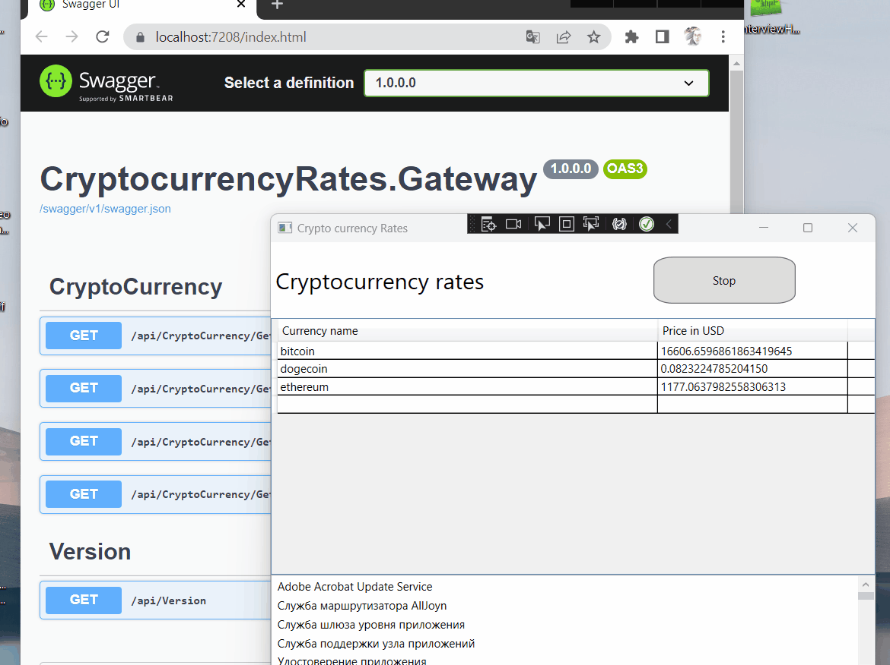

# WPFCryptocurrencyRates test task for desktop C# developer in iTero
```
https://gist.github.com/pavelkhrulev/bc891149e004475221acef1c956853bb
``
The project demonstrates getting and updating cryptocurrency exchange rates getting data about running Windows services and show names of services:
- Actual cryptocurrency rates
- Windows services that are currently running

Program written in C# language on .NET 6 in Visual Studio Enterprise 2022
- Project included server side microservice **CryptocurrencyRates.Gateway** for getting rates from coincap API
- Service library for concap API **CryptocurrencyRates.Services**
- Common library for further app extension **CryptocurrencyRates.Common**
- And WPF desktop application **CryptoCurrencyRates.Client**

In development mode in gateway microservice it be able to use Swagger UI for test server side app and coincap API
Logger is available in **CryptocurrencyRates.Gateway** and write into file. 
You should find it in **CryptocurrencyRates.Gateway** bin folder called Logs

Programm setup:
- CryptocurrencyRates.Gateway: use appsettings.json and next section
"ConcapApi": {
    "BaseUrl": "https://api.coincap.io/v2/rates",
    "Timeout":  -1 
  }
  
- CryptoCurrencyRates.Client use appsettings.json and next section to change host IP addrres for CryptocurrencyRates.Gateway
"CryptocurrencyRatesGateway": {
    "GatewayUrl": "https://localhost:7208/api/CryptoCurrency/GetCurrentRates"
  }
  
  
